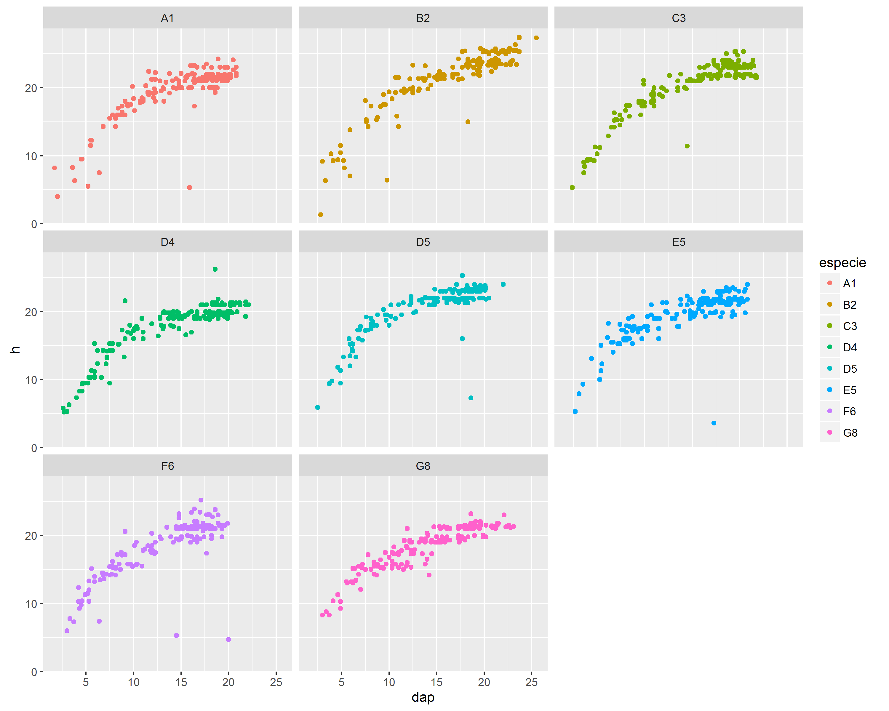
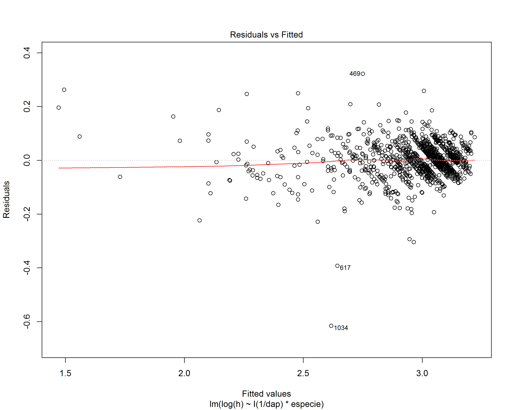
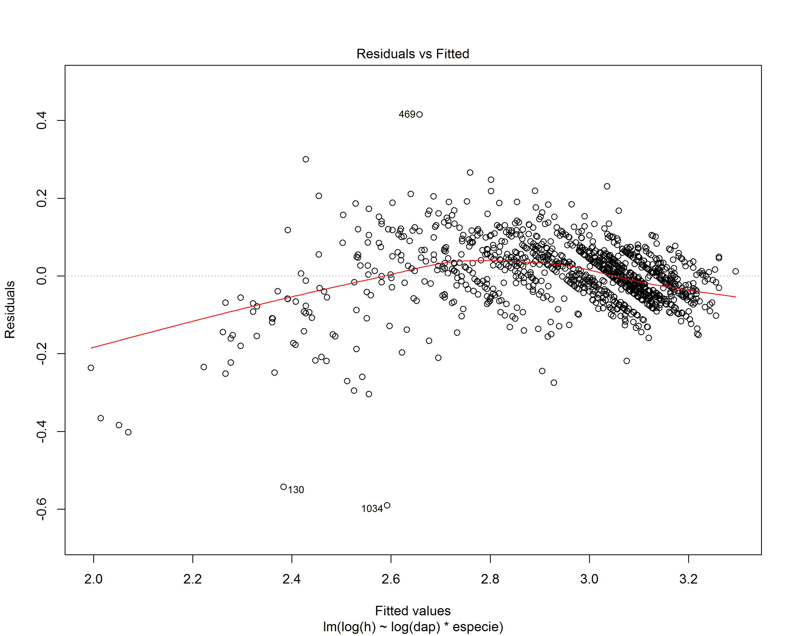
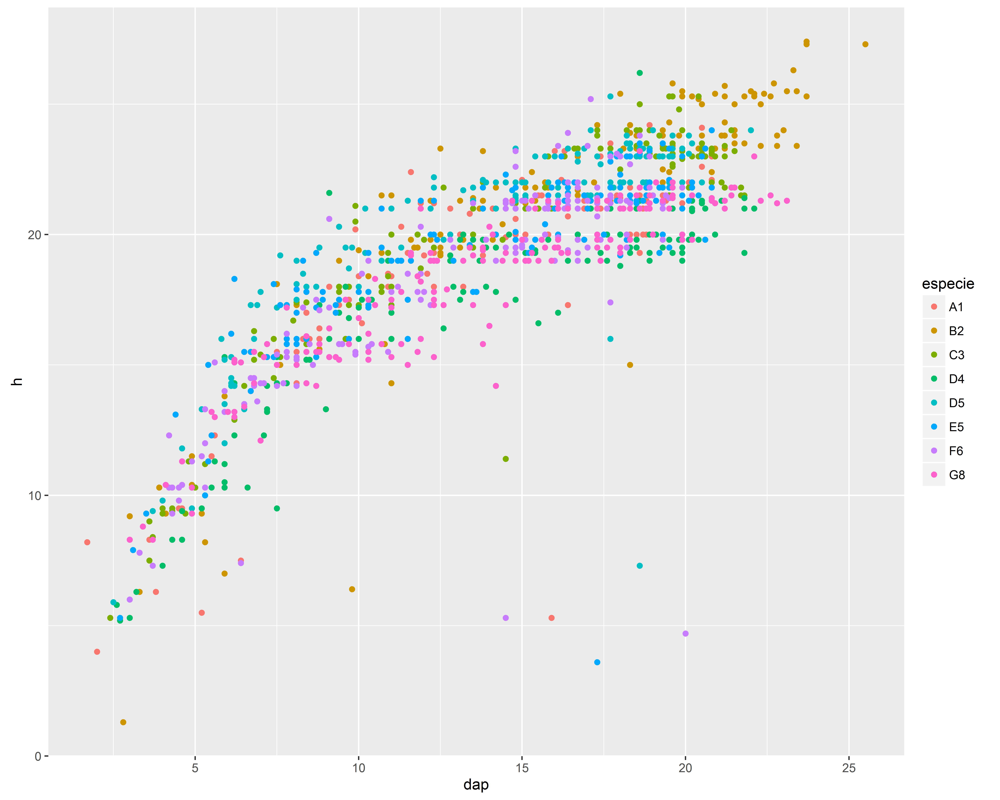

# Curso R - Manipulação de dados 2
Ítalo Cegatta  
3 de junho de 2016  


# Exemplo florestal

O objetivo desse roteiro é processar (de forma bem simples) um inventário. Primeiro vamos carregar os dados e fazer conhecer cada variável.


```r
library(pacman)
p_load(readxl, dplyr, tidyr, ggplot2, broom)

dados <- read_excel("dados_tume.xlsx")

summary(dados)
```

```
##    especie                h              dap            cod           
##  Length:1344        Min.   : 1.30   Min.   : 1.70   Length:1344       
##  Class :character   1st Qu.:17.80   1st Qu.:10.70   Class :character  
##  Mode  :character   Median :21.00   Median :15.90   Mode  :character  
##                     Mean   :19.44   Mean   :14.59                     
##                     3rd Qu.:21.80   3rd Qu.:18.60                     
##                     Max.   :27.40   Max.   :25.50                     
##                     NA's   :18      NA's   :18
```

```r
unique(dados$especie)
```

```
## [1] "A1" "B2" "C3" "D4" "D5" "E5" "F6" "G8"
```

```r
dados %>% 
  group_by(especie) %>% 
  summarise(
    n = n(),
    ndap = sum(!is.na(dap)),
    nh = sum(!is.na(h))
  )
```

```
## Source: local data frame [8 x 4]
## 
##   especie     n  ndap    nh
##     (chr) (int) (int) (int)
## 1      A1   168   168   168
## 2      B2   168   158   158
## 3      C3   168   168   168
## 4      D4   168   166   166
## 5      D5   168   164   164
## 6      E5   168   168   168
## 7      F6   168   168   168
## 8      G8   168   166   166
```

```r
ggplot(dados, aes(dap, h, colour=especie)) +
  geom_point() 
```

<!-- -->

```r
ggplot(dados, aes(dap, h, colour=especie)) +
  geom_point() + facet_wrap(~especie)
```

<!-- -->

Não será preciso estimar as alturas das árvores, pois temos todas as alturas medidas. Mas para exemplificar, vamos testar dois modelos hipsométricos.


```r
hipso1 <-  lm(log(h) ~ I(1/dap) * especie, data = filter(dados, is.na(cod)))
summary(hipso1)
```

```
## 
## Call:
## lm(formula = log(h) ~ I(1/dap) * especie, data = filter(dados, 
##     is.na(cod)))
## 
## Residuals:
##      Min       1Q   Median       3Q      Max 
## -0.61603 -0.03384  0.00097  0.03577  0.32159 
## 
## Coefficients:
##                     Estimate Std. Error t value Pr(>|t|)    
## (Intercept)         3.354534   0.012251 273.823  < 2e-16 ***
## I(1/dap)           -4.903372   0.150116 -32.664  < 2e-16 ***
## especieB2           0.060808   0.016993   3.578 0.000359 ***
## especieC3           0.005932   0.015067   0.394 0.693868    
## especieD4          -0.101063   0.015262  -6.622 5.26e-11 ***
## especieD5          -0.009569   0.016614  -0.576 0.564720    
## especieE5          -0.101361   0.017137  -5.915 4.29e-09 ***
## especieF6          -0.059916   0.016488  -3.634 0.000291 ***
## especieG8          -0.141275   0.016075  -8.788  < 2e-16 ***
## I(1/dap):especieB2 -0.049283   0.216810  -0.227 0.820221    
## I(1/dap):especieC3  0.370442   0.173427   2.136 0.032872 *  
## I(1/dap):especieD4  0.331862   0.174065   1.907 0.056809 .  
## I(1/dap):especieD5  0.947053   0.195205   4.852 1.38e-06 ***
## I(1/dap):especieE5  1.464442   0.204582   7.158 1.39e-12 ***
## I(1/dap):especieF6  0.569891   0.188228   3.028 0.002515 ** 
## I(1/dap):especieG8  1.124878   0.184114   6.110 1.33e-09 ***
## ---
## Signif. codes:  0 '***' 0.001 '**' 0.01 '*' 0.05 '.' 0.1 ' ' 1
## 
## Residual standard error: 0.06433 on 1251 degrees of freedom
## Multiple R-squared:  0.9137,	Adjusted R-squared:  0.9126 
## F-statistic: 882.6 on 15 and 1251 DF,  p-value: < 2.2e-16
```

```r
plot(hipso1, which = 1)
```

<!-- -->

```r
hipso2 <-  lm(log(h) ~ log(dap) * especie , data = filter(dados, is.na(cod)))
summary(hipso2)
```

```
## 
## Call:
## lm(formula = log(h) ~ log(dap) * especie, data = filter(dados, 
##     is.na(cod)))
## 
## Residuals:
##      Min       1Q   Median       3Q      Max 
## -0.59060 -0.04366 -0.00041  0.04510  0.41520 
## 
## Coefficients:
##                     Estimate Std. Error t value Pr(>|t|)    
## (Intercept)         1.776453   0.050070  35.480  < 2e-16 ***
## log(dap)            0.454479   0.018579  24.461  < 2e-16 ***
## especieB2           0.016566   0.071925   0.230 0.817874    
## especieC3          -0.188577   0.061054  -3.089 0.002055 ** 
## especieD4          -0.287262   0.061045  -4.706 2.81e-06 ***
## especieD5           0.219536   0.065959   3.328 0.000899 ***
## especieE5           0.330764   0.067453   4.904 1.06e-06 ***
## especieF6          -0.066759   0.064259  -1.039 0.299048    
## especieG8           0.040585   0.063046   0.644 0.519860    
## log(dap):especieB2  0.009344   0.026156   0.357 0.720980    
## log(dap):especieC3  0.075151   0.022689   3.312 0.000952 ***
## log(dap):especieD4  0.074577   0.022821   3.268 0.001113 ** 
## log(dap):especieD5 -0.060463   0.024640  -2.454 0.014271 *  
## log(dap):especieE5 -0.120496   0.025215  -4.779 1.97e-06 ***
## log(dap):especieF6  0.020868   0.024261   0.860 0.389856    
## log(dap):especieG8 -0.035680   0.023727  -1.504 0.132897    
## ---
## Signif. codes:  0 '***' 0.001 '**' 0.01 '*' 0.05 '.' 0.1 ' ' 1
## 
## Residual standard error: 0.08003 on 1251 degrees of freedom
## Multiple R-squared:  0.8664,	Adjusted R-squared:  0.8648 
## F-statistic: 540.7 on 15 and 1251 DF,  p-value: < 2.2e-16
```

```r
plot(hipso2, which = 1)
```

<!-- -->

```r
AIC(hipso1, hipso2)
```

```
##        df       AIC
## hipso1 17 -3339.038
## hipso2 17 -2785.625
```

```r
tidy(hipso1)
```

```
##                  term     estimate  std.error   statistic       p.value
## 1         (Intercept)  3.354534140 0.01225074 273.8229160  0.000000e+00
## 2            I(1/dap) -4.903371538 0.15011599 -32.6638849 9.673288e-170
## 3           especieB2  0.060807876 0.01699316   3.5783726  3.589572e-04
## 4           especieC3  0.005931972 0.01506713   0.3937028  6.938676e-01
## 5           especieD4 -0.101063258 0.01526225  -6.6217780  5.255132e-11
## 6           especieD5 -0.009569389 0.01661359  -0.5759976  5.647204e-01
## 7           especieE5 -0.101360959 0.01713740  -5.9146059  4.287512e-09
## 8           especieF6 -0.059915927 0.01648846  -3.6338091  2.905858e-04
## 9           especieG8 -0.141275209 0.01607520  -8.7883955  4.912591e-18
## 10 I(1/dap):especieB2 -0.049282711 0.21680951  -0.2273088  8.202208e-01
## 11 I(1/dap):especieC3  0.370441590 0.17342676   2.1360117  3.287212e-02
## 12 I(1/dap):especieD4  0.331861857 0.17406500   1.9065398  5.680913e-02
## 13 I(1/dap):especieD5  0.947052543 0.19520490   4.8515819  1.378922e-06
## 14 I(1/dap):especieE5  1.464442053 0.20458216   7.1582099  1.389613e-12
## 15 I(1/dap):especieF6  0.569891093 0.18822824   3.0276599  2.514990e-03
## 16 I(1/dap):especieG8  1.124878015 0.18411391   6.1096852  1.330896e-09
```

```r
glance(hipso1)
```

```
##   r.squared adj.r.squared      sigma statistic p.value df   logLik
## 1 0.9136623     0.9126271 0.06433213  882.5749       0 16 1686.519
##         AIC       BIC deviance df.residual
## 1 -3339.038 -3251.583 5.177417        1251
```

```r
dados$h_pred = cbind(exp(predict(hipso1, newdata = dados)))
dados
```

```
## Source: local data frame [1,344 x 5]
## 
##    especie     h   dap   cod    h_pred
##      (chr) (dbl) (dbl) (chr)     (dbl)
## 1       A1  15.5   8.1    NA 15.629804
## 2       A1  21.2  12.3    NA 19.218744
## 3       A1   7.5   6.4    11 13.308226
## 4       A1   4.0   2.0    11  2.466619
## 5       A1  18.0  12.3    NA 19.218744
## 6       A1  16.0   9.1   X10 16.704900
## 7       A1  16.0   8.8   X10 16.400845
## 8       A1  20.0  13.1    NA 19.692364
## 9       A1  21.5  15.5    NA 20.867389
## 10      A1  21.0  14.1    NA 20.222125
## ..     ...   ...   ...   ...       ...
```

Seguindo o processamento, vamos calcular a secções transversal e estimar o volume usando o fator de forma 0,42 para todas as espécies.


```r
dados <- dados %>% 
  mutate(
    g = (pi/40000)*(dap^2),
    v = g*h*0.42
  )
dados
```

```
## Source: local data frame [1,344 x 7]
## 
##    especie     h   dap   cod    h_pred            g            v
##      (chr) (dbl) (dbl) (chr)     (dbl)        (dbl)        (dbl)
## 1       A1  15.5   8.1    NA 15.629804 0.0051529974 0.0335460127
## 2       A1  21.2  12.3    NA 19.218744 0.0118822888 0.1057998996
## 3       A1   7.5   6.4    11 13.308226 0.0032169909 0.0101335213
## 4       A1   4.0   2.0    11  2.466619 0.0003141593 0.0005277876
## 5       A1  18.0  12.3    NA 19.218744 0.0118822888 0.0898301034
## 6       A1  16.0   9.1   X10 16.704900 0.0065038822 0.0437060883
## 7       A1  16.0   8.8   X10 16.400845 0.0060821234 0.0408718691
## 8       A1  20.0  13.1    NA 19.692364 0.0134782179 0.1132170302
## 9       A1  21.5  15.5    NA 20.867389 0.0188691909 0.1703887936
## 10      A1  21.0  14.1    NA 20.222125 0.0156145009 0.1377198978
## ..     ...   ...   ...   ...       ...          ...          ...
```

Agora vamos resumir os dados por espécie.


```r
parcela <- dados %>% 
  group_by(especie) %>% 
  summarise(
    n = sum(!is.na(dap)),
    d = mean(dap, na.rm=T),
    g = sum(g, na.rm=T),
    v = sum(v, na.rm=T)
  )
parcela
```

```
## Source: local data frame [8 x 5]
## 
##   especie     n        d        g        v
##     (chr) (int)    (dbl)    (dbl)    (dbl)
## 1      A1   168 14.79524 3.166432 27.89429
## 2      B2   158 16.30190 3.671624 35.95922
## 3      C3   168 15.21250 3.423320 31.86655
## 4      D4   166 14.44217 3.092629 25.55748
## 5      D5   164 14.37927 2.960277 27.25549
## 6      E5   168 14.41429 3.026970 26.49040
## 7      F6   168 13.35000 2.650221 22.42628
## 8      G8   166 13.93675 2.845643 23.70331
```

```r
pov <- parcela %>% 
  transmute(
    Especie = especie,
    N = n*(10000/1440),
    G = g*(10000/1440),
    V = v*(10000/1440),
    IMA = V/4.5
  )
pov
```

```
## Source: local data frame [8 x 5]
## 
##   Especie        N        G        V      IMA
##     (chr)    (dbl)    (dbl)    (dbl)    (dbl)
## 1      A1 1166.667 21.98911 193.7104 43.04675
## 2      B2 1097.222 25.49739 249.7168 55.49262
## 3      C3 1166.667 23.77306 221.2955 49.17678
## 4      D4 1152.778 21.47659 177.4825 39.44056
## 5      D5 1138.889 20.55748 189.2742 42.06094
## 6      E5 1166.667 21.02063 183.9611 40.88025
## 7      F6 1166.667 18.40431 155.7380 34.60845
## 8      G8 1152.778 19.76141 164.6063 36.57918
```

```r
ggplot(pov, aes(reorder(Especie, -V), IMA)) +
  geom_bar(stat = "identity")
```

<!-- -->
